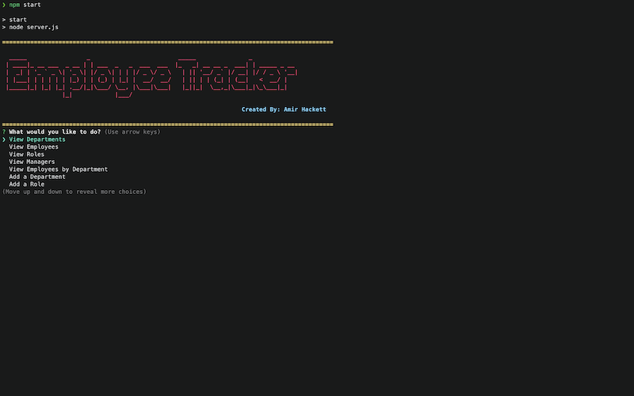

# Employee Tracker

## Description
*A command-line application to manage a company's employee database, using Node.js, Inquirer, and MySQL*

## Contents
* [Usage](#Usage)
   * [Screenshot](#Screenshot)
* [Video-Description](#Video-Description:)
* [Schema-Description](#Schema-Description)
* [Instructions](#Instructions)
* [Built With](#Built-With)
* [Credits](#Credits)

## Usage

GIVEN a command-line application that accepts user input
- WHEN I start the application
  - THEN I am presented with the following options: view all departments, view all roles, view all employees, add a department, add a role, add an employee, and update an employee role
- WHEN I choose to view all departments
  - THEN I am presented with a formatted table showing department names and department ids
- WHEN I choose to view all roles
  - THEN I am presented with the job title, role id, the department that role belongs to, and the salary for that role
- WHEN I choose to view all employees
  - THEN I am presented with a formatted table showing employee data, including employee ids, first names, last names, job titles, departments, salaries, and managers that the employees report to
- WHEN I choose to add a department
  - THEN I am prompted to enter the name of the department and that department is added to the database
- WHEN I choose to add a role
  - THEN I am prompted to enter the name, salary, and department for the role and that role is added to the database
- WHEN I choose to add an employee
  - THEN I am prompted to enter the employee’s first name, last name, role, and manager and that employee is added to the database
- WHEN I choose to update an employee role
  - THEN I am prompted to select an employee to update and their new role and this information is updated in the database

## Screenshot



## Video Description:
The below video is a demonstration of how this application is supposed to work. 


## Schema Description

- Department
    - `id`: INT PRIMARY KEY
    - `name`: VARCHAR(30) to hold department name

- Role
    - `id`: INT PRIMARY KEY
    - `title`: VARCHAR(30) to hold role title
    - `salary`: DECIMAL to hold role salary
    - `department_id`: INT to hold reference to department role belongs to

- Employee
    - `id`: INT PRIMARY KEY
    - `first_name`: VARCHAR(30) to hold employee first name
    - `last_name`: VARCHAR(30) to hold employee last name
    - `role_id`: INT to hold reference to employee role
    - `manager_id`: INT to hold reference to another employee that is manager of the current employee. This field may be null if the employee has no manager.

## Instructions

- Add a .env file to the root of the app with the following details

```text
DB_NAME='all_employees'
DB_USER='root'
DB_PW='xxx'
```

## Built With
* MySql2
* Promise-MySql
* Node.js
* Express.js
* Console Table
* Dotenv
* JavaScript
* Inquirer
* Chalk
* Figlet


## Credits
* Created by Amir Hackett 